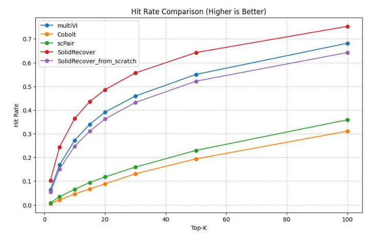

## Solid Recover: constructing mulit-omics pretrained model by alignment 

This repository contains the code for the project "Solid Recover: constructing mulit-omics pretrained model by alignment". 

Solid Recover(SR) is a method for constructing a multi-omics pretrained model by model alignment, overcoming the limitation of mulit-omics datasets. 

Briefly, we construct a single cell RNA pretrained model(4M cells) and  a single cell ATAC pretrained model(2M cells) using AutoEncoder model(VAE model also works), then we align the two pretrained models using the alignment technique, with a small size mulit-omics dataset(~50K cells).

Currently, pretrained SR model get the best performance on unpaired single cell datasets alignment. We will evaluate its performance on more downstream tasks.

