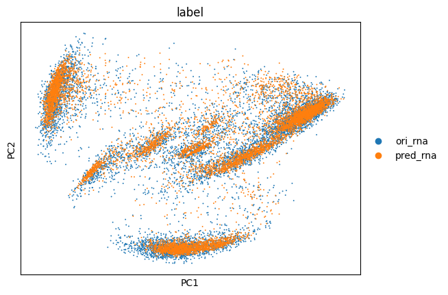
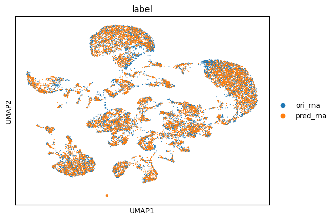
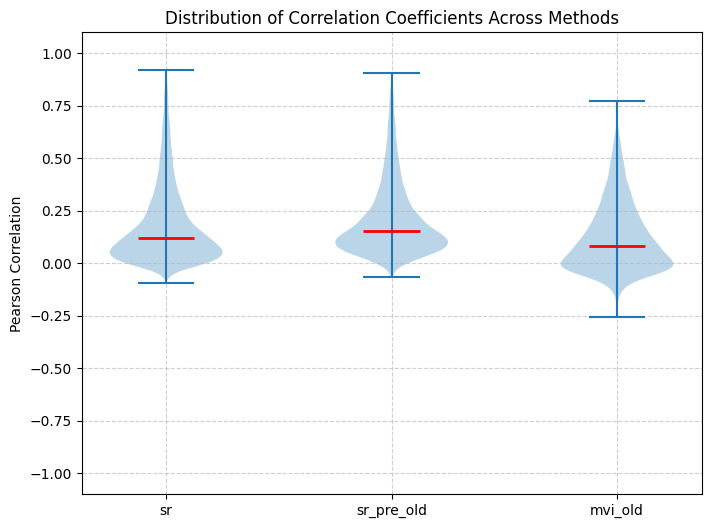
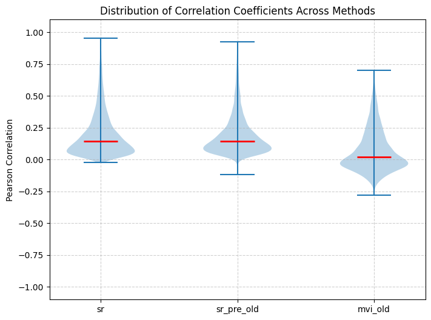
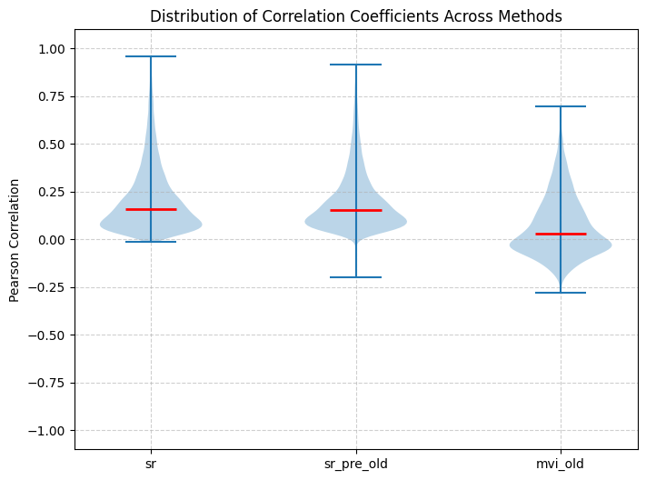
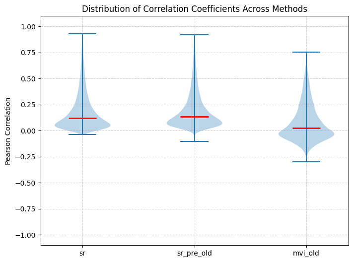

<h1 style="text-align: center;">Solid Recover: aligned deep generative model for multimodal data integration analysis</h1>


- [摘要](#摘要)
- [Result](#result)
- [模型介绍](#模型介绍)
  - [模型组件：](#模型组件)
  - [评估标准](#评估标准)
    - [跨模态匹配任务评估](#跨模态匹配任务评估)
    - [跨模态预测（生成）任务评估：](#跨模态预测生成任务评估)
    - [预训练增强评估](#预训练增强评估)
    - [in-silico 扰动任务评估](#in-silico-扰动任务评估)
- [跨模态匹配任务评估](#跨模态匹配任务评估-1)
- [跨模态预测（生成）任务评估](#跨模态预测生成任务评估-1)


## 摘要

提出了Solid Recover 框架，通过深度生成模型建模单一模态数据，之后通过对比学习方法构建对齐模型用于多组学数据的整合分析，在跨模态匹配、缺失模态生成以及调控网络推断上取得SOTA表现。Solid recover 框架支持通过单组学数据的预训练来进一步提升跨模态表征性能。


## Result

1. 模型介绍
2. 跨模态匹配任务评估
   - 评估embedding 在多模态之间的一致性
   - 评估embedding 保持的生物学信息
3. 跨模态预测任务评估 
   - 评估生成的样本和真实样本的可分性
   - 评估生成特征和真实特征的一致性
4. 单模态预训练增强模型表现
   - 使用预训练模型后相同任务的表现
   - 不同规模的预训练对后续的影响
   - 预训练模型迁移到其他数据或者其他组织的表现
5. in-silico 扰动任务评估
6. allen brain atlas 对齐数据库
   - 使用最大规模的多组学表征模型，将allen brain atlas 和 snatac-seq数据库构建一个匹配数据集，供查询
7. Supplement: 模型消融
   - 使用gene activity 和 atac seq数据 的差异
   - vae- ae 模型的差异
   - embedding-dim 的影响
   - loss中不同weight的影响
   - 合成数据训练效果

## 模型介绍

### 模型组件：

- Encoder: (MLP with GELU activation with RMSnorm)
    $$
    \begin{aligned}
    & \mathbf{Enc(\cdot)} : R^{p} \rightarrow R^{h} \\
    &  x \in R^{p} \rightarrow \mathbf{z} \in R^{h}
    \end{aligned}
    $$
- Reparametrization:
  - $\mu$ Projection:
    $$
    \begin{aligned}
    & \mathbf{Proj_{\mu}(\cdot)} : R^{h} \rightarrow R^{d} \\
    & z\in R^{h} \rightarrow z_{\mu} \in R^{d} 
    \end{aligned}
    $$
  - $\log(var)$ projection:
    $$
    \begin{aligned}
    & \mathbf{Proj_{\log\sigma^2}(\cdot)} : R^{h} \rightarrow R^{d} \\
    & z\in R^{h} \rightarrow z_{\log\sigma^2} = \log(z_\sigma^2) \in R^{d} 
    \end{aligned}
    $$ 
  - $z_{embed} = z_{\mu} + 0.5*\exp(z_{\log\sigma^2}) * \epsilon \sim \mathcal{N}(z_{\mu}, z_{\sigma})$
- Decoder:
  $$
    \begin{aligned}
    & \mathbf{Dec(\cdot)} : R^{d} \rightarrow R^{h} \\
    &  x \in R^{p} \rightarrow \mathbf{z} \in R^{h}
    \end{aligned}
  $$

- Loss:
  - 匹配数据对齐训练
  $$
    \begin{aligned}
    &\mathcal{L} = (\alpha * \mathcal{L}_{recon} + (1-\alpha) * \mathcal{L}_{cross-recon}) + \mathcal{L}_{kl} + \lambda * \mathcal{L}_{align}\\
    & \mathcal{L}_{recon} = \frac{1}{N} \sum_{i=1}^{N} || \mathbf{Dec}^{A}(z_{A}^{i}) - x_{A}^{i}||^{2} + \frac{1}{N} \sum_{i=1}^{N} || \mathbf{Dec}^{B}(z_{B}^{i}) - x_{B}^{i}||^{2}\\
    & \mathcal{L}_{cross-recon} = \frac{1}{N} \sum_{i=1}^{N} || \mathbf{Dec}^{B}(z_{A}^{i}) - x_{B}^{i}||^{2} + \frac{1}{N} \sum_{i=1}^{N} || \mathbf{Dec}^{A}(z_{B}^{i}) - x_{A}^{i}||^{2}\\
    &\mathcal{L}_{kl} =  -\mathcal{D}_{kl}(q(z_{A}\vert x_{A}) , p(z_{A})) - \mathcal{D}_{kl}(q(z_{B}\vert x_{B}) , p(z_{B})) \\
    & \mathcal{L}_{align} = -\frac{1}{2N}*\sum_{i=1}^{N} (sim(z_{A}^{i}, z_{B}^{i}) + sim(z_{B}^{i}, z_{A}^{i})) \\
    &z_{A} = z_{embed}^{A}, \;\; z_{B} = z_{embed}^{B} \\
    & sim(z_{A}^{i}, z_{B}^{i}) = \log(\frac{\exp{c_{ii}}}{\sum_{j=1}^{N} \exp{c_{ij}}}) \\
    & c_{ij} = \frac{1}{\tau} *\frac{z_{A}^{i}\cdot z_B^{j}}{||z_A^i||*||z_{B}^{j}||}
    \end{aligned}  
  $$
  - 单一模态预训练 + 匹配数据对齐训练

### 评估标准 

#### 跨模态匹配任务评估 

给定多组学数据的rna embedding $X_R \in R^{N\times d}$ 和 atac embedding $X_A \in R^{N\times d}$，使用如下指标来评估两组embedding 之间的匹配效果。

- Top-k hit rate: 

  对多组学样本 $x$, 分别计算其 rna embedding 在全部atac embedding 的top-k 近邻的对应的atac embedding的命中率以及atac embedding 在全部rna embedding 的top-k 近邻的对应的rna embedding的命中率。

  $$
  \begin{aligned}
    &\mathcal{N^{k}}(x_i^{R}; X_A) = top_{k}\{j \in \{1,2,...,N\} \vert d(x_{i}^{R}, x_{j}^{A})\} \\
    &\mathcal{N^{k}}(x_i^{A}; X_R) = top_{k}\{j \in \{1,2,...,N\} \vert d(x_{i}^{A}, x_{j}^{R})\}
  \end{aligned}
  $$

    单个样本命中率定义
  $$
  \begin{aligned}
    &HitRate_{k}^{A\rightarrow R}(x_{i}^{A}) = \mathbf{1}[i \in \mathcal{N^{k}}(x_i^{A}; X_R) ] \\
    &HitRate_{k}^{R\rightarrow A}(x_{i}^{R}) = \mathbf{1}[i \in \mathcal{N^{k}}(x_i^{R}; X_A) ]
  \end{aligned}
  $$

    数据集上命中率定义：

    $$
    \begin{aligned}
    & \mathrm{mHR}@k^{A\rightarrow R} = \frac{1}{N} \sum_{i=1}^{N}\mathbf{1}[i \in \mathcal{N^{k}}(x_i^{A}; X_R) ] \\
    & \mathrm{mHR}@k^{R\rightarrow A} = \\
    & \mathrm{mHR}@k = \frac{1}{2}*(\mathrm{mHR}@k^{A\rightarrow R} + \mathrm{mHR}@k^{R\rightarrow A})
    \end{aligned}
    $$

  <font color = 'red'>在我当前的实现中，是将rna embedding 和 atac embedding 放到一个pool中去检索，后续要再调整
  
  这里的d应该写成相似性更合适</font> 

  - FOSCTTM:
    
    $$
    \text{FOSCTTM} = \frac{1}{2N} \left( \sum_{i=1}^{N} \frac{n_1^{(i)}}{N} + \sum_{i=1}^{N} \frac{n_2^{(i)}}{N} \right)
    $$

    $$
    n_1^{(i)} = \left| \left\{ j \mid d(\mathbf{x}_j, \mathbf{y}_i) < d(\mathbf{x}_i, \mathbf{y}_i) \right\} \right|, n_2^{(i)} = \left| \left\{ j \mid d(\mathbf{x}_i, \mathbf{y}_j) < d(\mathbf{x}_i, \mathbf{y}_i) \right\} \right|
    $$

- Match Score:

#### 跨模态预测（生成）任务评估：

已知$X_{A}$, 基于$X_{A}$ 生成 $X_{R}$ 的预测$\hat{X}_{R}$

- 可分性：
    $$
    \begin{aligned}
    \mathbf{X} &= 
    \begin{bmatrix}
    \mathbf{X}_A \\
    \mathbf{X}_R
    \end{bmatrix}
    \in \mathbb{R}^{2n \times d}, \\
    \mathbf{y} &= [\underbrace{0, \dots, 0}_{n}, \underbrace{1, \dots, 1}_{n}] \in \mathbb{R}^{2n}.
    \end{aligned}
    $$

    构建一个分类器 $f(x)$, 分类准确性越低说明生成的越逼真。

- 相关性：
    对给定基因 $g$, 计算生成的 $\hat{x}_{g}$ 和 真实的 $x_{g}$ 之间的相关性

- 分布的kl距离 

#### 预训练增强评估 


在相同的模型架构和数据集上，对比预训练的模型和从头训练的模型的性能差异。

评估不同预训练数据量级的影响。

#### in-silico 扰动任务评估 

当前已有跨模态的预测生成能力，如果扰动ATAC数据，例如关闭某些RE，

$$ 
\begin{aligned}
&x_A \rightarrow \mathrm{MASK}[x_A] \\
&\hat{x}_R = f(x_A) \rightarrow f(\mathrm{MASK}[x_R]) =\hat{x}_R +\delta 
\end{aligned}
$$

$\delta$揭示了扰动的调控效应。

## 跨模态匹配任务评估 

<!-- 目前在前3个case下，无预训练的SR方法性能优于其他方法。
在跨数据集的case下，无预训练的SR方法低于multiVI和scPair。


 -->

## 跨模态预测（生成）任务评估

<!-- 目前完成了部分评估脚本，在case 3下做了一些评估 

- 可分性评估：
  ```python
  lg model training...
  lg auc: 0.8727315880530171 lg acc: 0.8149556400506971
  knn model training...
  knn auc: 0.5 knn acc: 0.5012674271229405
  ```
  
  
- 重构rna相关性评估：
  
   -->

<!-- ### case 1:


### case 2


### case 3


### case 4
 -->

