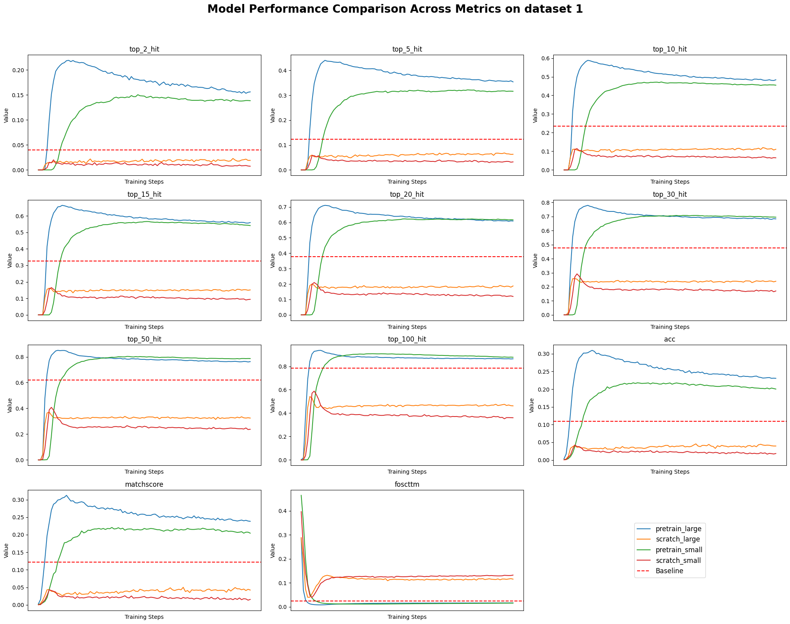
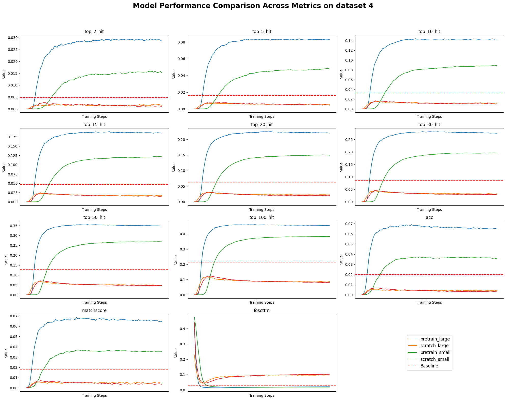
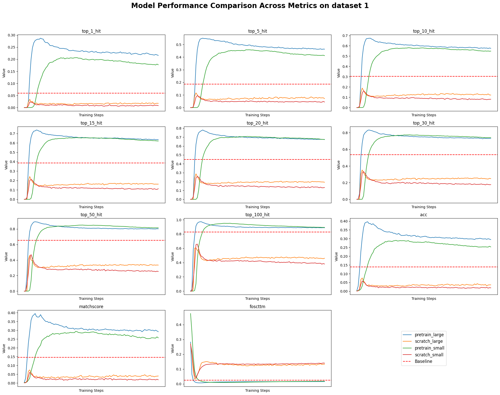
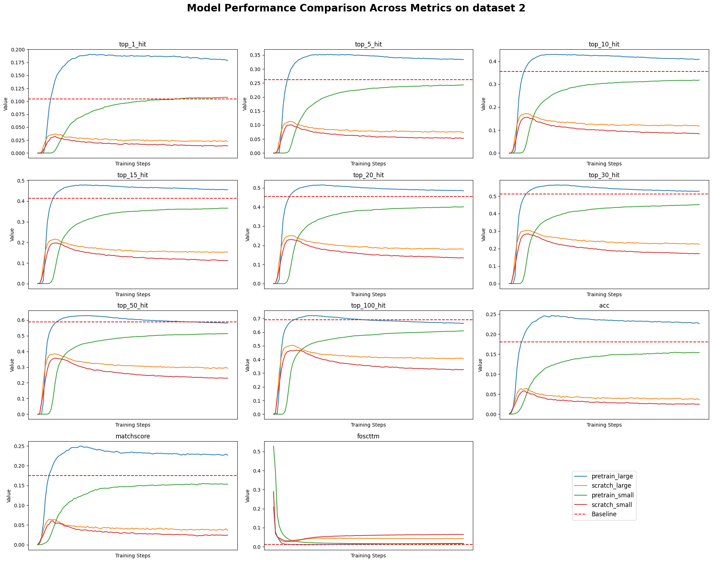
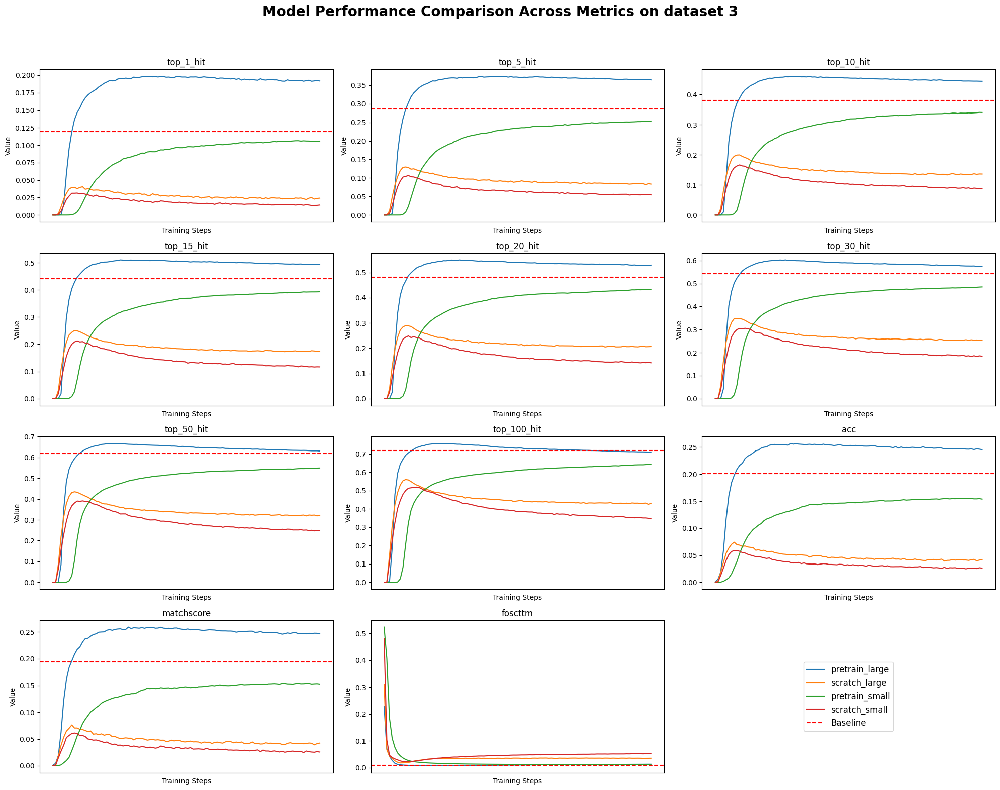
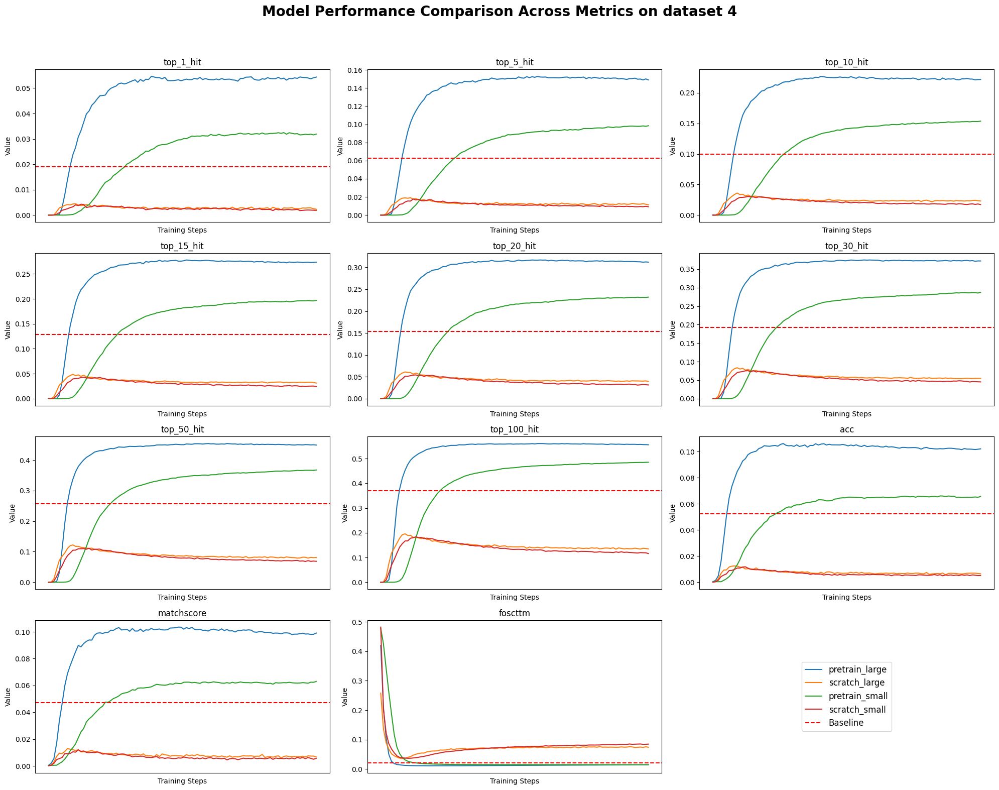

### Table 1 跨模态匹配评估

数据集：10X小鼠，自有小鼠8个脑区 

划分策略：
1. 10X 小鼠 9：1划分 (10k) 评估小数据集上的效果
2. 自有小鼠 9：1划分  (50k) 评估中型数据集上的效果
3. 10X 小鼠 + 自有小鼠 9：1划分  (60k) 评估存在批次的数据集上的效果
4. 自有小鼠训练，10X 小鼠测试 评估迁移的能力

|模型|top-1 rate|top-5 rate|top-10 rate|top-20 rate|top-50 rate|top-100 rate|acc|matching score|fosttm|
|---|---|---|---|---|---|---|---|---|---|
|cobolt| | | | | | | | | |
|scpair| | | | | | | | | |
|multivi| | | | | | | | | |
|scbutterfly| | | | | | | | | |
|sr-ae-1024-pretrained| | | | | | | | | |
|sr-ae-1024-scratch| | | | | | | | | |
|sr-ae-128-pretrained| | | | | | | | | |
|sr-ae-128-scratch| | | | | | | | | |
|sr-ae-1024-pretrained, w.o. clip| | | | | | | | | |
|sr-ae-1024-scratch, w.o. clip| | | | | | | | | |
|sr-ae-128-pretrained, w.o. clip| | | | | | | | | |
|sr-ae-128-scratch, w.o. clip| | | | | | | | | |
|sr-ae-1024-pretrained, w.o. cross| | | | | | | | | |
|sr-ae-1024-scratch, w.o. cross| | | | | | | | | |
|sr-ae-128-pretrained, w.o. cross| | | | | | | | | |
|sr-ae-128-scratch, w.o. cross| | | | | | | | | |

从下面的实验结果中可以看到如下结果：
1. pretrain 效果比 scratch 训练的效果好。 
2. 在小型数据集上以及zero shot实验上(1,4), pretrain提升效果优于中型数据集以及非zero shot实验上。
3. 两阶段scratch训练效果不如mvi。

上述实验结果由于评测数据被删除，无法复现，现在以下面的评测结果为准：

### Table 2 多模态整合评估
