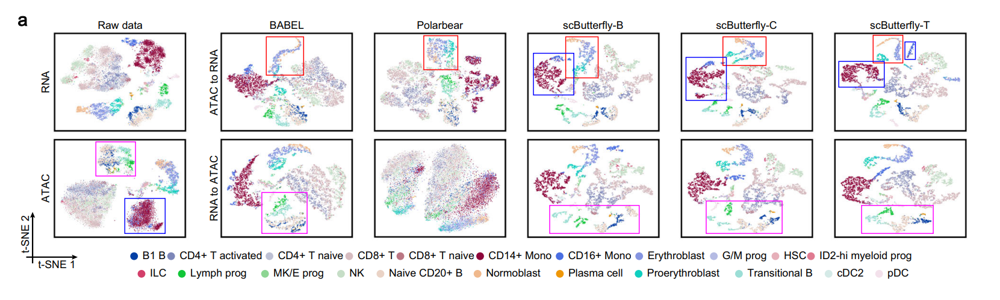
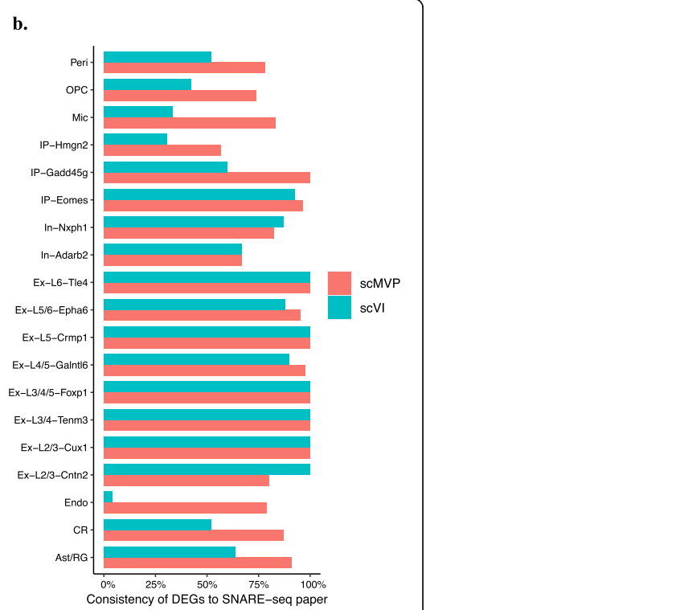
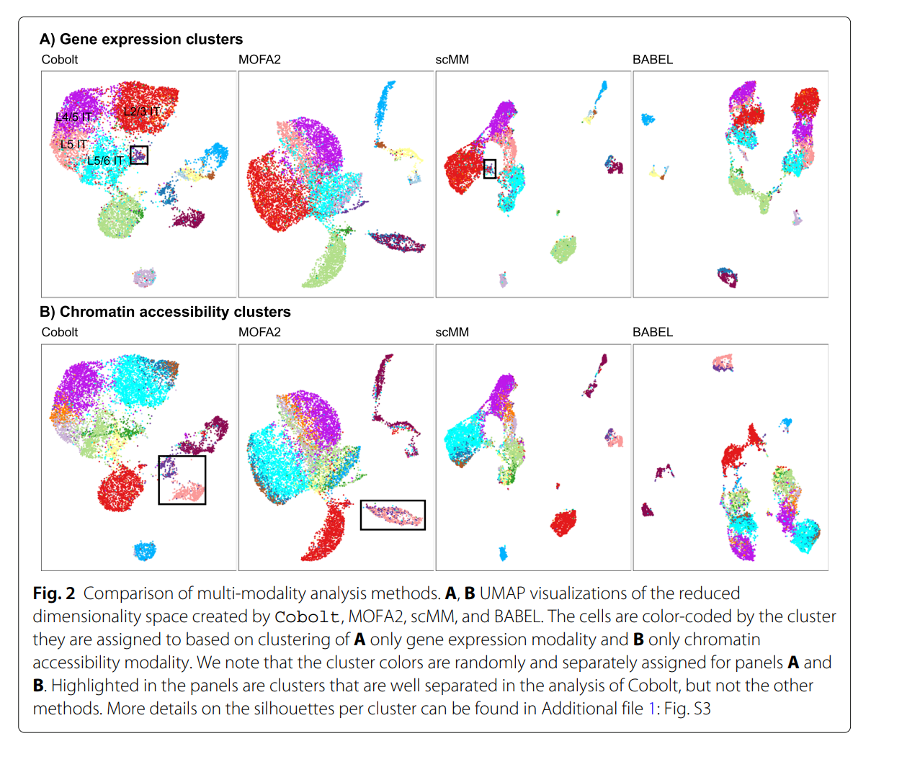
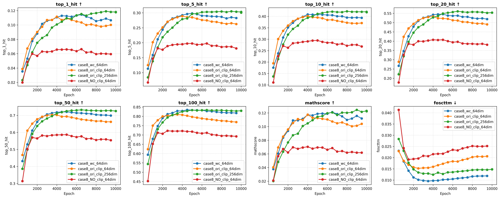
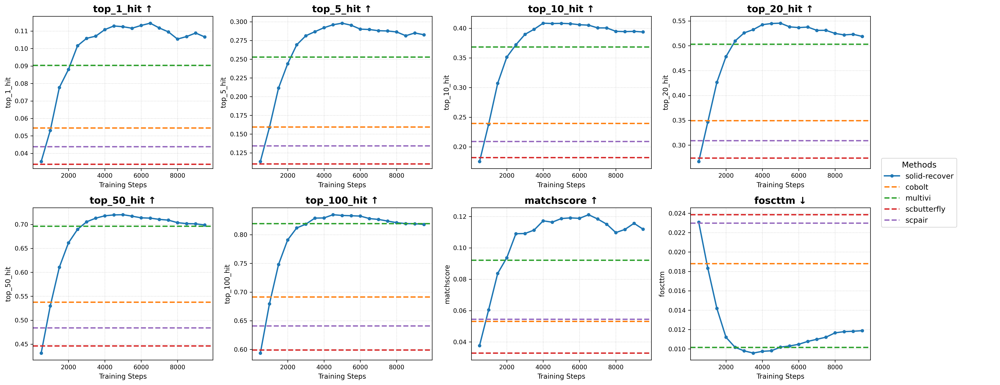
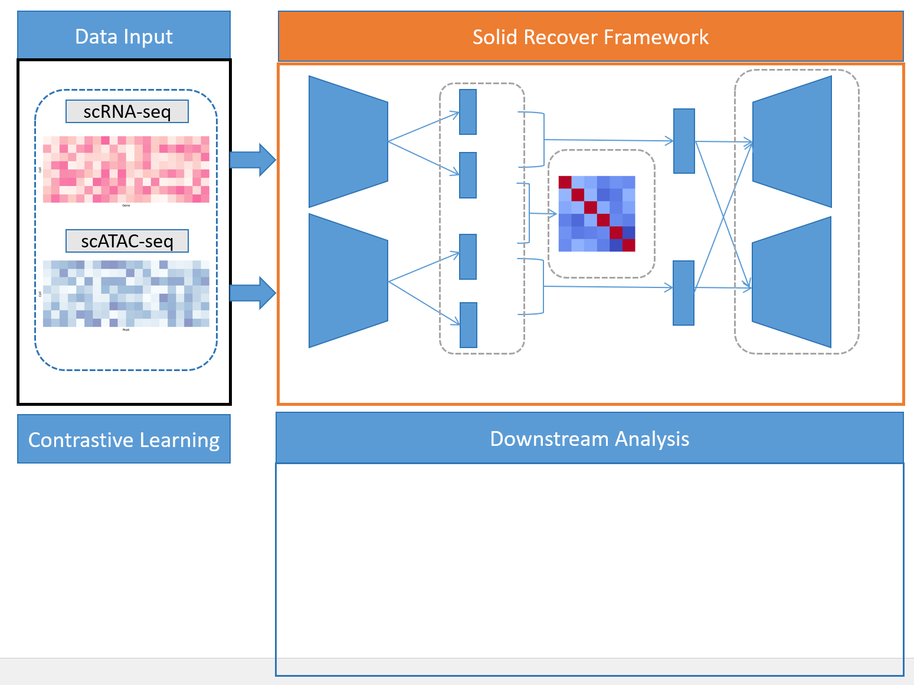
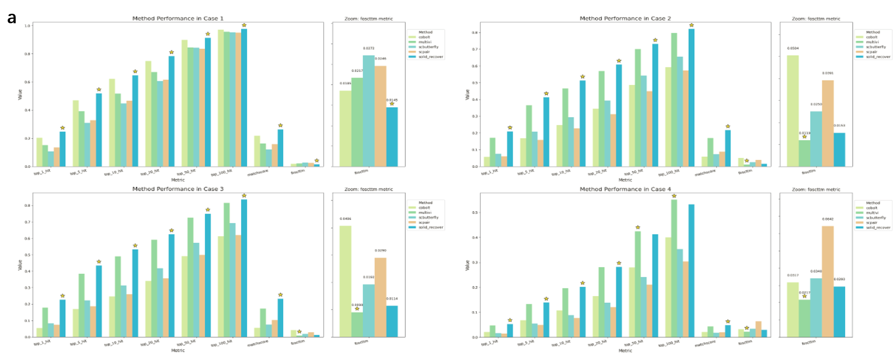

- [2025.10.27 建议：](#20251027-建议)
- [Figure 1.](#figure-1)
- [Figure 2.](#figure-2)
  - [Figure 2.a.](#figure-2a)
  - [Figure 2.b.](#figure-2b)
  - [Figure 2.c.](#figure-2c)
- [Figure 3.](#figure-3)
  - [Figure 3.a.](#figure-3a)
  - [Figure 3.b.](#figure-3b)


## 2025.10.27 建议：


1. 公开数据集。
   - 参考近期Nature Method上的benchmark收集数据。现有数据集：
     - BMMC (with cell anno)
     - Snare-seq mouse skin (with cell anno)
     - 10x HSPC (with cell anno)
     - 10x mus brain (no anno) 
     - 10x PBMC (no anno)
   - 缺少anno的数据集需要替换掉
   - 上述数据集要重新处理，处理成兼容当前SR及对比方法框架的格式
   - 可以添加 rna + adt 数据集 
   - 施鹏老师组的小鼠全脑数据可以用于后续的生物学结果展示
   - <font color="red"> 方法总结，intro </font>
2. 说明对比学习优势。
   - 给出直观的图片说明 对比学习能实现，其他方法实现不了的
     - scbutterfly 参考展示形式
       
     - scmvp 参考展示形式
        
     - cobolt 参考展示形式
       
   - 从BMMC评测上可以看到contrastive loss的提升
      仅使用跨模态预测(no clip) 的表现和 cobolt, scpair, scbutterfly 等类似策略的表现一致。

      增加对比学习后表现显著提升, multivi可以认为是无负样本情形。

      clip中加入自适应权重后，会在foscttm中表现更优，在全局的信息保持上表现更好。
        
        
    - 是否调整loss为 adaptive-clip?
        现有clip中将全部非匹配视为负样本，可能造成同种细胞类型的过度分离。

        原始clip 公式：

        $$ 
        \begin{aligned}
        \min \mathcal{L}(d_{ii}, d_{ij}) &= -\log \frac{\exp(d_{ii})}{\sum_{j} \exp(d_{ij})} \\
        &= -d_{ii} + \log \sum_{j} \exp(d_{ij})  \;\; d_{ij} \in [-T,T]
        \end{aligned}
        $$ 

        最小化上述目标，最小化全部负样本对 $d_{ij}$. 但是对$(i,j)$来自同一细胞类型，clip可能会导致细胞类型之间的过度分离。

        考虑原始clip中负样本的梯度 

        $$
        \begin{aligned}
        &\frac{\partial \mathcal{L}}{\partial d_{ij}} =  \frac{\exp(d_{ij})}{\sum_{j} \exp(d_{ij})}  \\
        &d_{ij}^{new} = d_{ij} - \eta \frac{\exp(d_{ij})}{\sum_{j} \exp(d_{ij})} < d_{ij}
        \end{aligned}
        $$ 

        如果对前面的相似度$d_{ij}$进行赋权, 延缓来自同一细胞类型的样本对$d_{ij}$的降低，可以降低细胞类型之间的过度分离。

        weighted_clp 公式：

        $$ 
        \begin{aligned}
        \min \mathcal{L^{w}}(d_{ii}, d_{ij}) &= -\log \frac{\exp(w_{ii}*d_{ii})}{\sum_{j} \exp(w_{ij}*d_{ij})} \\
        &= -w_{ii}*d_{ii} + \log \sum_{j} \exp(w_{ij}*d_{ij})  \;\; d_{ij} \in [-T,T]
        \end{aligned}
        $$ 


        考虑如下简单的加权策略：
        ```
        w_ii = 1
        w_ij 中 top-k 的高度相似样本赋予权重  w = 0.1 
        其他样本权重保持不变。
        ```

        加权clip中高度相似负样本梯度

        $$
        \begin{aligned}
        &\frac{\partial \mathcal{L^{w}}}{\partial d_{ij}} =  \frac{w*\exp(w*d_{ij})}{\sum_{j} \exp(w_{ij}*d_{ij})}  \\
        &\sim \frac{w*\exp(w*d_{ij})}{\alpha_{ij} + \exp(w*d_{ij})}\\
        &\alpha_{ij} = \sum_{k\neq j} \exp(d_{ik}) \\

        &d_{ij}^{new} = d_{ij} - \eta \frac{w*\exp(w*d_{ij})}{\alpha_{ij} + \exp(w*d_{ij})} > d_{ij} - \eta \frac{\exp(d_{ij})}{\sum_{j} \exp(d_{ij})}
        \end{aligned}
        $$ 

        从而能保证来自相似cluster的样本对的相似度$d_{ij}$ 不会过度衰减。现在的初步实验中也验证了这一点，加权clip会有更好的ARI,NMI等聚类指标，在匹配命中率上基本稳定，在匹配任务的FOSCTTM上优于原始clip


## Figure 1.



## Figure 2. 

### Figure 2.a.

**展示匹配任务量化指标**

替换数据集为公开数据集


### Figure 2.b. 

**展示对比学习能实现其他方法不能实现的效果** 

UMAP展示，标注关注cluster 

### Figure 2.c.

**ARI, NMI 等指标量化** 

## Figure 3. 

### Figure 3.a. 

**展示生成数据的质量（pcc,auc）**

### Figure 3.b.

**展示生成数据cluster DEG 通路富集**